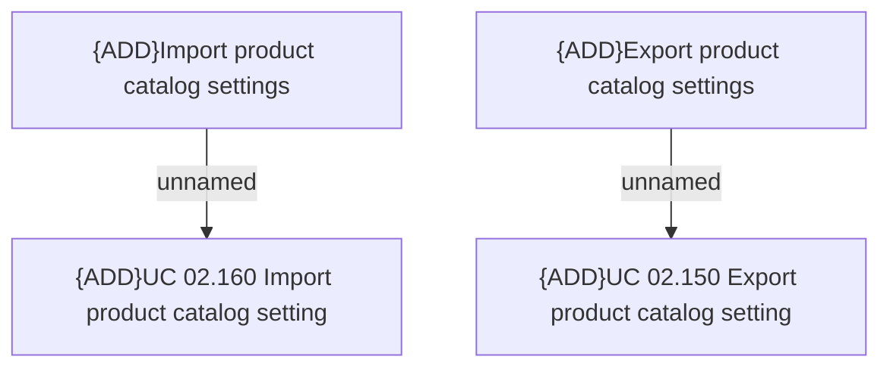

# Access Rights

- **Diagram Type**: Custom
- **Package**: HomerSelect/BSL/Modules/Product Catalog (PRC)/Interface Provided/Product Catalog REST API/Product catalog export/import/Access Rights
- **Diagram ID**: 137957
- **Elements**: 4
- **Connectors**: 2

