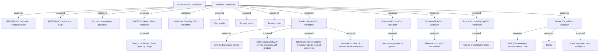

# Validation Rules

```mermaid
graph TD
    Get_list_of_commodity_types["Get list of commodity types"]
    MOD_Product_activation_validation_rules["{MOD}Product activation validation rules"]
    ADD_Get_Codelists_from_CSD["{ADD}Get Codelists from CSD"]
    Product_catalog_entity_activation["Product catalog entity activation"]
    flat_rate_to_air_validation["flat-rate-to-air - validation"]
    Search_for_Allowed_Base_Types_by_Usage["Search for Allowed Base Types by Usage"]
    MOD_SubventionDto_validation["{MOD}SubventionDto - validation"]
    Service_Exclusivity_Check["Service Exclusivity Check"]
    Check_compatibility_of_service_attributes_with_product["Check compatibility of service attributes with product"]
    MOD_Check_compatibility_of_service_type_to_product_propertie["{MOD}Check compatibility of service type to product properties"]
    Maximal_number_of_services_of_the_same_type["Maximal number of services of the same type"]
    Unique_assignment_to_product["Unique assignment to product"]
    Cash_payment_cross_validations["Cash payment cross validations"]
    Terms["Terms"]
    MOD_Generating_of_product_variant_code["{MOD}Generating of product variant code"]
    Installment_Due_Day_Shift_validation["Installment Due Day Shift - validation"]
    Max_goods["Max goods"]
    Product_name["Product name"]
    Product_code["Product code"]
    ProductServiceDto_validation["ProductServiceDto - validation"]
    DocumentPrintoutDto_validation["DocumentPrintoutDto - validation"]
    Maximal_number_of_documents["Maximal number of documents"]
    ContainerRuleDto_validation["ContainerRuleDto - validation"]
    ProductCommodityTypeDto_validation["ProductCommodityTypeDto - validation"]
    ProductVariantDto_validation["ProductVariantDto - validation"]
    Product_validation["Product - validation"]
    ProductVariantDto_validation -->|unnamed| MOD_Generating_of_product_variant_code
    Product_validation -->|unnamed| ADD_Get_Codelists_from_CSD
    Product_validation -->|unnamed| Product_catalog_entity_activation
    MOD_SubventionDto_validation -->|unnamed| Search_for_Allowed_Base_Types_by_Usage
    Product_validation -->|unnamed| MOD_SubventionDto_validation
    ProductServiceDto_validation -->|unnamed| Service_Exclusivity_Check
    ProductServiceDto_validation -->|unnamed| Check_compatibility_of_service_attributes_with_product
    ProductServiceDto_validation -->|unnamed| MOD_Check_compatibility_of_service_type_to_product_propertie
    ProductServiceDto_validation -->|unnamed| Maximal_number_of_services_of_the_same_type
    DocumentPrintoutDto_validation -->|unnamed| Unique_assignment_to_product
    Product_validation -->|unnamed| MOD_Product_activation_validation_rules
    ProductVariantDto_validation -->|unnamed| Terms
    ProductCommodityTypeDto_validation -->|unnamed| Get_list_of_commodity_types
    Product_validation -->|unnamed| Installment_Due_Day_Shift_validation
    Product_validation -->|unnamed| Max_goods
    Product_validation -->|unnamed| Product_name
    Product_validation -->|unnamed| Product_code
    Product_validation -->|unnamed| ProductServiceDto_validation
    Product_validation -->|unnamed| DocumentPrintoutDto_validation
    ContainerRuleDto_validation -->|unnamed| Maximal_number_of_documents
    Product_validation -->|unnamed| ContainerRuleDto_validation
    Product_validation -->|unnamed| ProductCommodityTypeDto_validation
    Product_validation -->|unnamed| ProductVariantDto_validation
    ProductVariantDto_validation -->|unnamed| Cash_payment_cross_validations
```
