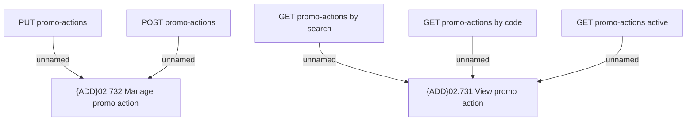

# Access Right

- **Diagram Type**: Custom
- **Package**: HomerSelect/BSL/Modules/Product Catalog (PRC)/Interface Provided/Product Catalog REST API/Promo Actions/Access Right
- **Diagram ID**: 158449
- **Elements**: 7
- **Connectors**: 5

