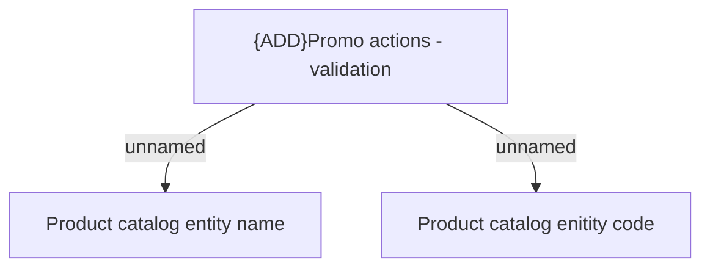

# Validation Rules

- **Diagram Type**: Custom
- **Package**: HomerSelect/BSL/Modules/Product Catalog (PRC)/Interface Provided/Product Catalog REST API/Promo Actions/Validation Rules
- **Diagram ID**: 158430
- **Elements**: 3
- **Connectors**: 2

