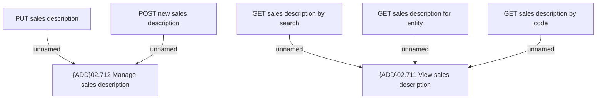

# Access Rights

```mermaid
graph TD
    PUT_sales_description["PUT sales description"]
    POST_new_sales_description["POST new sales description"]
    GET_sales_description_for_entity["GET sales description for entity"]
    GET_sales_description_by_search["GET sales description by search"]
    GET_sales_description_by_code["GET sales description by code"]
    ADD_02_712_Manage_sales_description["{ADD}02.712 Manage sales description"]
    ADD_02_711_View_sales_description["{ADD}02.711 View sales description"]
    GET_sales_description_by_search -->|unnamed| ADD_02_711_View_sales_description
    GET_sales_description_for_entity -->|unnamed| ADD_02_711_View_sales_description
    PUT_sales_description -->|unnamed| ADD_02_712_Manage_sales_description
    POST_new_sales_description -->|unnamed| ADD_02_712_Manage_sales_description
    GET_sales_description_by_code -->|unnamed| ADD_02_711_View_sales_description
```
