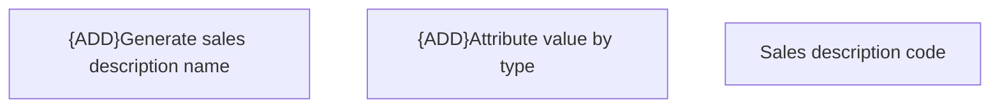

# Business Rules

- **Diagram Type**: Custom
- **Package**: HomerSelect/BSL/Modules/Product Catalog (PRC)/Interface Provided/Product Catalog REST API/Sales Descriptions/Business Rules
- **Diagram ID**: 161079
- **Elements**: 3
- **Connectors**: 0

