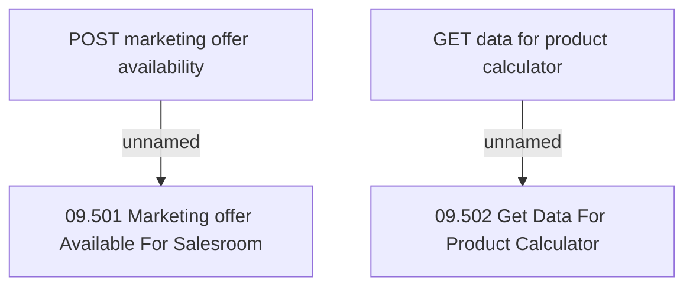

# Access Rights

```mermaid
graph TD
    POST_marketing_offer_availability["POST marketing offer availability"]
    GET_data_for_product_calculator["GET data for product calculator"]
    n_09_502_Get_Data_For_Product_Calculator["09.502 Get Data For Product Calculator"]
    n_09_501_Marketing_offer_Available_For_Salesroom["09.501 Marketing offer Available For Salesroom"]
    POST_marketing_offer_availability -->|unnamed| n_09_501_Marketing_offer_Available_For_Salesroom
    GET_data_for_product_calculator -->|unnamed| n_09_502_Get_Data_For_Product_Calculator
```
