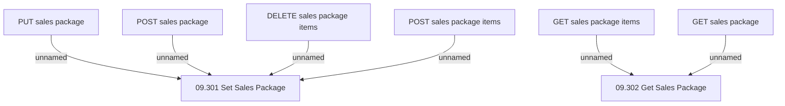

# Access Rights

- **Diagram Type**: Custom
- **Package**: HomerSelect/BSL/Modules/Product Catalog (PRC)/Interface Provided/Product Catalog REST API/Sales Packages/Access Rights
- **Diagram ID**: 133495
- **Elements**: 8
- **Connectors**: 6

