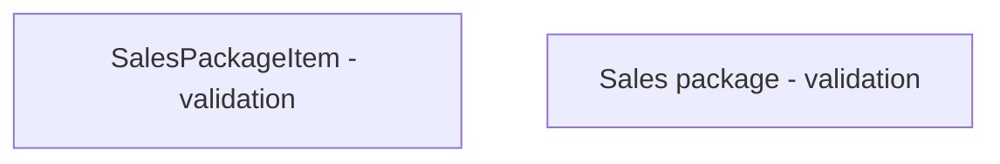

# Validation rules

- **Diagram Type**: Custom
- **Package**: HomerSelect/BSL/Modules/Product Catalog (PRC)/Interface Provided/Product Catalog REST API/Sales Packages/Validation rules
- **Diagram ID**: 133976
- **Elements**: 2
- **Connectors**: 0

