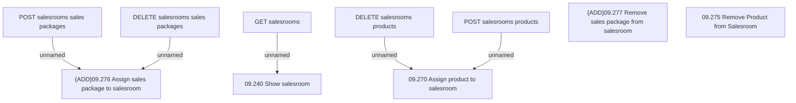

# Access Rights

```mermaid
graph TD
    POST_salesrooms_sales_packages["POST salesrooms sales packages"]
    GET_salesrooms["GET salesrooms"]
    DELETE_salesrooms_sales_packages["DELETE salesrooms sales packages"]
    DELETE_salesrooms_products["DELETE salesrooms products"]
    POST_salesrooms_products["POST salesrooms products"]
    n_09_240_Show_salesroom["09.240 Show salesroom"]
    ADD_09_277_Remove_sales_package_from_salesroom["{ADD}09.277 Remove sales package from salesroom"]
    ADD_09_276_Assign_sales_package_to_salesroom["{ADD}09.276 Assign sales package to salesroom"]
    n_09_275_Remove_Product_from_Salesroom["09.275 Remove Product from Salesroom"]
    n_09_270_Assign_product_to_salesroom["09.270 Assign product to salesroom"]
    GET_salesrooms -->|unnamed| n_09_240_Show_salesroom
    DELETE_salesrooms_products -->|unnamed| n_09_270_Assign_product_to_salesroom
    POST_salesrooms_sales_packages -->|unnamed| ADD_09_276_Assign_sales_package_to_salesroom
    POST_salesrooms_products -->|unnamed| n_09_270_Assign_product_to_salesroom
    DELETE_salesrooms_sales_packages -->|unnamed| ADD_09_276_Assign_sales_package_to_salesroom
```
