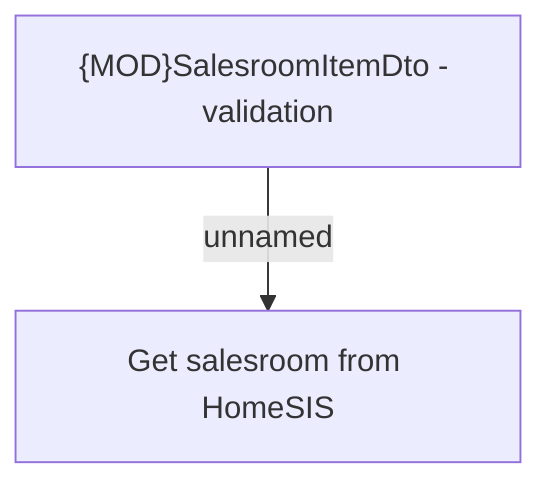

# Validation Rules

```mermaid
graph TD
    Get_salesroom_from_HomeSIS["Get salesroom from HomeSIS"]
    MOD_SalesroomItemDto_validation["{MOD}SalesroomItemDto - validation"]
    MOD_SalesroomItemDto_validation -->|unnamed| Get_salesroom_from_HomeSIS
```
