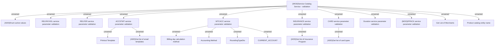

# Validation Rules

```mermaid
graph TD
    ADD_Enum_active_values["{ADD}Enum active values"]
    RELPAYHOL_service_parameter_validation["RELPAYHOL service parameter validation"]
    RELFER_service_parameter_validation["RELFER service parameter validation"]
    Printout_Template["Printout Template"]
    Accounting_Method["Accounting Method"]
    ADD_Get_list_of_email_templates["{ADD}Get list of email templates"]
    ACCSTMT_service_parameter_validation["ACCSTMT service parameter validation"]
    ADD_Get_list_of_card_types["{ADD}Get list of card types"]
    CARD_service_parameter_validation["CARD service parameter validation"]
    RoundingTypeDto["RoundingTypeDto"]
    Billing_day_calculation_method["Billing day calculation method"]
    CURRENT_ACCOUNT["CURRENT_ACCOUNT"]
    MTCACC_service_parameter_validation["MTCACC service parameter validation"]
    ADD_Get_list_of_Insurance_Program["{ADD}Get list of Insurance Program"]
    INSURANCE_service_parameter_validation["INSURANCE service parameter validation"]
    Duration_service_parameter_validation["Duration service parameter validation"]
    MOD_IPPACK_service_parameter_validation["{MOD}IPPACK service parameter validation"]
    Get_List_of_Merchants["Get List of Merchants"]
    Product_catalog_entity_name["Product catalog entity name"]
    MOD_Service_Catalog_Service_validation["{MOD}Service Catalog Service - validation"]
    MTCACC_service_parameter_validation -->|unnamed| Billing_day_calculation_method
    MOD_Service_Catalog_Service_validation -->|unnamed| RELPAYHOL_service_parameter_validation
    MOD_Service_Catalog_Service_validation -->|unnamed| RELFER_service_parameter_validation
    ACCSTMT_service_parameter_validation -->|unnamed| Printout_Template
    MTCACC_service_parameter_validation -->|unnamed| Accounting_Method
    ACCSTMT_service_parameter_validation -->|unnamed| ADD_Get_list_of_email_templates
    MOD_Service_Catalog_Service_validation -->|unnamed| ACCSTMT_service_parameter_validation
    CARD_service_parameter_validation -->|unnamed| ADD_Get_list_of_card_types
    MOD_Service_Catalog_Service_validation -->|unnamed| ADD_Enum_active_values
    MTCACC_service_parameter_validation -->|unnamed| RoundingTypeDto
    MOD_Service_Catalog_Service_validation -->|unnamed| Product_catalog_entity_name
    MTCACC_service_parameter_validation -->|unnamed| CURRENT_ACCOUNT
    MOD_Service_Catalog_Service_validation -->|unnamed| MTCACC_service_parameter_validation
    INSURANCE_service_parameter_validation -->|unnamed| ADD_Get_list_of_Insurance_Program
    MOD_Service_Catalog_Service_validation -->|unnamed| INSURANCE_service_parameter_validation
    MOD_Service_Catalog_Service_validation -->|unnamed| Duration_service_parameter_validation
    MOD_Service_Catalog_Service_validation -->|unnamed| MOD_IPPACK_service_parameter_validation
    MOD_Service_Catalog_Service_validation -->|unnamed| Get_List_of_Merchants
    MOD_Service_Catalog_Service_validation -->|unnamed| CARD_service_parameter_validation
```
