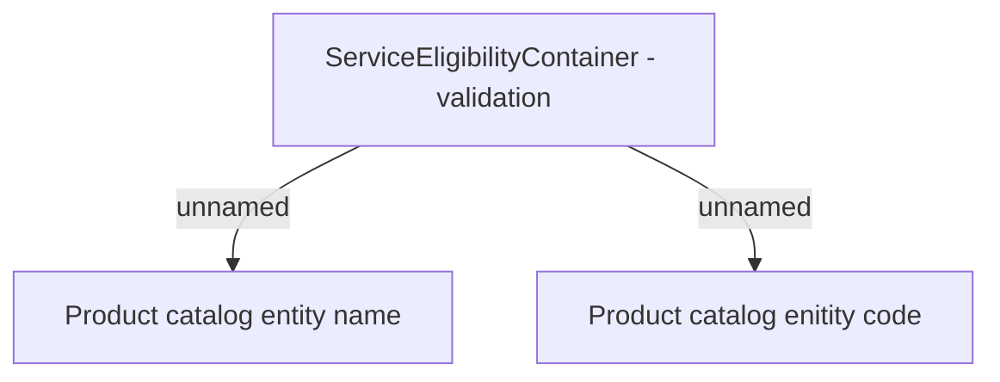

# Validation Rules

```mermaid
graph TD
    Product_catalog_entity_name["Product catalog entity name"]
    Product_catalog_enitity_code["Product catalog enitity code"]
    ServiceEligibilityContainer_validation["ServiceEligibilityContainer - validation"]
    ServiceEligibilityContainer_validation -->|unnamed| Product_catalog_entity_name
    ServiceEligibilityContainer_validation -->|unnamed| Product_catalog_enitity_code
```
