# Access Rights

- **Diagram Type**: Custom
- **Package**: HomerSelect/BSL/Modules/Product Catalog (PRC)/Interface Provided/Product Catalog REST API/Services/Access Rights
- **Diagram ID**: 161446
- **Elements**: 19
- **Connectors**: 17

```mermaid
graph TD
    n_08_180_Activate_Service_version_manually["08.180 Activate Service version manually"]
    n_08_175_Offer_Service["08.175 Offer Service"]
    MOD_POST_service_offers["{MOD} POST service-offers"]
    MOD_PUT_service_activations["{MOD}PUT service activations"]
    n_08_180_Activate_Service_version["08.180 Activate Service version"]
    PUT_service_relations["PUT service-relations"]
    n_08_410_Set_Service_Relation["08.410 Set Service Relation"]
    GET_service_relations["GET service-relations"]
    MOD_PUT_services["{MOD}PUT services"]
    GET_service_versions["GET service-versions"]
    MOD_POST_services["{MOD}POST services"]
    MOD_GET_services["{MOD}GET services"]
    DELETE_services["DELETE services"]
    n_08_150_Set_main_Service_properties["08.150 Set main Service properties"]
    n_08_140_Cancel_Service_version["08.140 Cancel Service version"]
    n_08_130_Create_Service_version["08.130 Create Service version"]
    n_08_120_Create_Service["08.120 Create Service"]
    n_08_205_Provide_List_of_Service_Versions["08.205 Provide List of Service Versions"]
    n_08_200_Provide_Service_Data["08.200 Provide Service Data"]
    DELETE_services -->|unnamed| n_08_140_Cancel_Service_version
    MOD_PUT_service_activations -->|unnamed| n_08_180_Activate_Service_version_manually
    MOD_PUT_service_activations -->|unnamed| n_08_180_Activate_Service_version
    MOD_POST_service_offers -->|unnamed| n_08_175_Offer_Service
    GET_service_relations -->|unnamed| n_08_200_Provide_Service_Data
    MOD_POST_services -->|unnamed| n_08_180_Activate_Service_version_manually
    MOD_POST_services -->|unnamed| n_08_150_Set_main_Service_properties
    MOD_POST_services -->|unnamed| n_08_130_Create_Service_version
    MOD_POST_services -->|unnamed| n_08_180_Activate_Service_version
    MOD_POST_services -->|unnamed| n_08_120_Create_Service
    GET_service_versions -->|unnamed| n_08_205_Provide_List_of_Service_Versions
    MOD_PUT_services -->|unnamed| n_08_150_Set_main_Service_properties
    MOD_PUT_services -->|unnamed| n_08_180_Activate_Service_version
    MOD_PUT_services -->|unnamed| n_08_180_Activate_Service_version_manually
    MOD_PUT_services -->|unnamed| n_08_130_Create_Service_version
    PUT_service_relations -->|unnamed| n_08_410_Set_Service_Relation
    MOD_GET_services -->|unnamed| n_08_200_Provide_Service_Data
```

