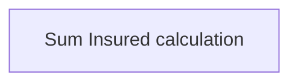

# Business Rules

- **Diagram Type**: Custom
- **Package**: HomerSelect/BSL/Modules/Product Catalog (PRC)/Interface Provided/Product Catalog REST API/Services/Business Rules
- **Diagram ID**: 153322
- **Elements**: 1
- **Connectors**: 0

