# Validation Rules

- **Diagram Type**: Custom
- **Package**: HomerSelect/BSL/Modules/Product Catalog (PRC)/Interface Provided/Product Catalog REST API/Services/Validation Rules
- **Diagram ID**: 164262
- **Elements**: 32
- **Connectors**: 28

```mermaid
graph TD
    Search_for_Allowed_Base_Types_by_Usage["Search for Allowed Base Types by Usage"]
    Logical_Data_Model_Base_Types["Logical Data Model : Base Types"]
    MOD_Base_Type["{MOD}Base Type"]
    Product_catalog_enitity_code["Product catalog enitity code"]
    CURRENT_ACCOUNT["CURRENT_ACCOUNT"]
    ADD_Get_Codelists_from_CSD["{ADD}Get Codelists from CSD"]
    MOD_PCG_5122_Service_offer_validation["{MOD PCG-5122}
Service offer - validation"]
    Product_catalog_entity_activation["Product catalog entity activation"]
    Insurance_program_validation["Insurance program - validation"]
    EarlyRepaymentAlgorithm_validation["EarlyRepaymentAlgorithm - validation"]
    PaymentDisciplineParameters_Tolerance_for_Last_DPD_cross_val["PaymentDisciplineParameters Tolerance for Last DPD - cross validation"]
    PREFDD_DueDaysMap_validation["PREFDD DueDaysMap - validation"]
    Only_one_version_is_active_for_a_service_code["Only one version is active for a service code"]
    LengthInMonths_MoratoriumInMonths["LengthInMonths ›= MoratoriumInMonths"]
    ServiceParametersInputFERVariants_validations["ServiceParametersInputFERVariants - validations"]
    ADD_Account_type_validation["{ADD}Account type validation"]
    PaymentDisciplineParametersDto_validation["PaymentDisciplineParametersDto - validation"]
    Numeric_range_0_30["Numeric range [0-30]"]
    Numeric_range_0_100["Numeric range [0-100]"]
    CHDD_days_after_last_due_date_validation["CHDD days after last due date - validation"]
    CET_days_expiration_date_limits_validation["CET days expiration date limits - validation"]
    Disbursement_method_validation["Disbursement method validation"]
    MOD_ServiceParametersDto_validation["{MOD}ServiceParametersDto - validation"]
    Unique_assignment_to_service["Unique assignment to service"]
    ServiceDocumentPrintoutDto_validation["ServiceDocumentPrintoutDto - validation"]
    MOD_Service_relations_validation["{MOD}Service relations - validation"]
    ServiceSubventionInputDto_validation["ServiceSubventionInputDto - validation"]
    ValidFrom_ValidTo_of_Service["ValidFrom-ValidTo of Service"]
    Service_qualification_criteria_check["Service qualification criteria check"]
    MOD_Service_and_Tariff_cross_validation["{MOD}Service and Tariff cross validation"]
    Service_name["Service name"]
    Service_validation["Service - validation"]
    MOD_ServiceParametersDto_validation -->|unnamed| PaymentDisciplineParametersDto_validation
    MOD_ServiceParametersDto_validation -->|unnamed| MOD_Base_Type
    Service_validation -->|unnamed| Product_catalog_enitity_code
    MOD_ServiceParametersDto_validation -->|unnamed| CURRENT_ACCOUNT
    MOD_ServiceParametersDto_validation -->|unnamed| ADD_Get_Codelists_from_CSD
    Service_validation -->|unnamed| Product_catalog_entity_activation
    MOD_ServiceParametersDto_validation -->|unnamed| Insurance_program_validation
    MOD_ServiceParametersDto_validation -->|unnamed| EarlyRepaymentAlgorithm_validation
    PaymentDisciplineParametersDto_validation -->|unnamed| PaymentDisciplineParameters_Tolerance_for_Last_DPD_cross_val
    MOD_ServiceParametersDto_validation -->|unnamed| PREFDD_DueDaysMap_validation
    Service_validation -->|unnamed| Only_one_version_is_active_for_a_service_code
    MOD_ServiceParametersDto_validation -->|unnamed| LengthInMonths_MoratoriumInMonths
    MOD_ServiceParametersDto_validation -->|unnamed| Search_for_Allowed_Base_Types_by_Usage
    MOD_ServiceParametersDto_validation -->|unnamed| ADD_Account_type_validation
    Service_validation -->|unnamed| Service_name
    MOD_ServiceParametersDto_validation -->|unnamed| Numeric_range_0_30
    MOD_ServiceParametersDto_validation -->|unnamed| Numeric_range_0_100
    MOD_ServiceParametersDto_validation -->|unnamed| CHDD_days_after_last_due_date_validation
    MOD_ServiceParametersDto_validation -->|unnamed| CET_days_expiration_date_limits_validation
    MOD_ServiceParametersDto_validation -->|unnamed| Disbursement_method_validation
    Service_validation -->|unnamed| MOD_ServiceParametersDto_validation
    ServiceDocumentPrintoutDto_validation -->|unnamed| Unique_assignment_to_service
    Service_validation -->|unnamed| ServiceDocumentPrintoutDto_validation
    Service_validation -->|unnamed| ServiceSubventionInputDto_validation
    Service_validation -->|unnamed| ValidFrom_ValidTo_of_Service
    Service_validation -->|unnamed| Service_qualification_criteria_check
    Service_validation -->|unnamed| MOD_Service_and_Tariff_cross_validation
    MOD_ServiceParametersDto_validation -->|unnamed| ServiceParametersInputFERVariants_validations
```

