# Access Rights

- **Diagram Type**: Custom
- **Package**: HomerSelect/BSL/Modules/Product Catalog (PRC)/Interface Provided/Product Catalog REST API/Tariffs/Access Rights
- **Diagram ID**: 162716
- **Elements**: 14
- **Connectors**: 14

```mermaid
graph TD
    n_04_180_Activate_Tariff_version_manually["04.180 Activate Tariff version manually"]
    MOD_PUT_tariff_activations["{MOD}PUT tariff activations"]
    n_04_180_Activate_Tariff_version["04.180 Activate Tariff version"]
    GET_tariff_items["GET tariff-items"]
    MOD_POST_tariffs["{MOD}POST tariffs"]
    MOD_PUT_tariffs["{MOD}PUT tariffs"]
    GET_tariffs["GET tariffs"]
    GET_tariff_versions["GET tariff-versions"]
    DELETE_tariffs["DELETE tariffs"]
    n_04_310_Provide_List_of_Tariff_Versions["04.310 Provide List of Tariff Versions"]
    n_04_060_Set_main_Tariff_properties["04.060 Set main Tariff properties"]
    n_04_300_Provide_Tariff_Data["04.300 Provide Tariff Data"]
    n_04_160_Create_Tariff_version["04.160 Create Tariff version"]
    n_04_170_Cancel_Tariff_version["04.170 Cancel Tariff version"]
    MOD_POST_tariffs -->|unnamed| n_04_180_Activate_Tariff_version
    MOD_POST_tariffs -->|unnamed| n_04_160_Create_Tariff_version
    MOD_POST_tariffs -->|unnamed| n_04_180_Activate_Tariff_version_manually
    MOD_POST_tariffs -->|unnamed| n_04_060_Set_main_Tariff_properties
    GET_tariff_versions -->|unnamed| n_04_310_Provide_List_of_Tariff_Versions
    MOD_PUT_tariff_activations -->|unnamed| n_04_180_Activate_Tariff_version
    MOD_PUT_tariff_activations -->|unnamed| n_04_180_Activate_Tariff_version_manually
    DELETE_tariffs -->|unnamed| n_04_170_Cancel_Tariff_version
    MOD_PUT_tariffs -->|unnamed| n_04_060_Set_main_Tariff_properties
    MOD_PUT_tariffs -->|unnamed| n_04_160_Create_Tariff_version
    MOD_PUT_tariffs -->|unnamed| n_04_180_Activate_Tariff_version
    MOD_PUT_tariffs -->|unnamed| n_04_180_Activate_Tariff_version_manually
    GET_tariffs -->|unnamed| n_04_300_Provide_Tariff_Data
    GET_tariff_items -->|unnamed| n_04_300_Provide_Tariff_Data
```

