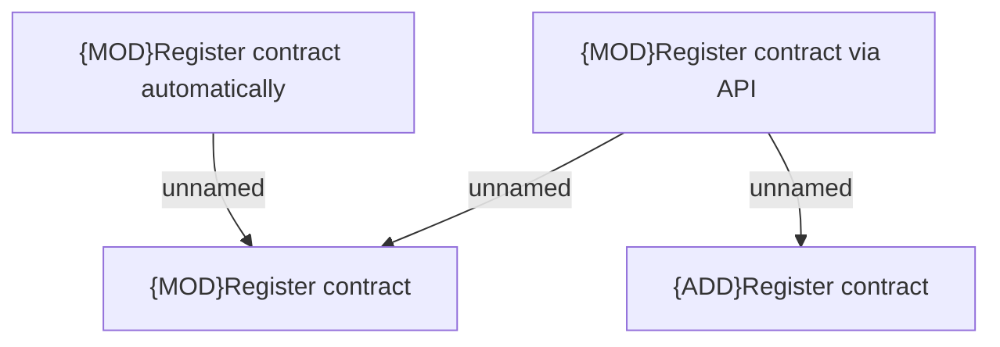

# Access Rights

- **Diagram Type**: Custom
- **Package**: HomerSelect/BSL/Modules/Registration module (REM)/Analytical model/Registrations/Contracts/Register contract/Access Rights
- **Diagram ID**: 160027
- **Elements**: 4
- **Connectors**: 3

