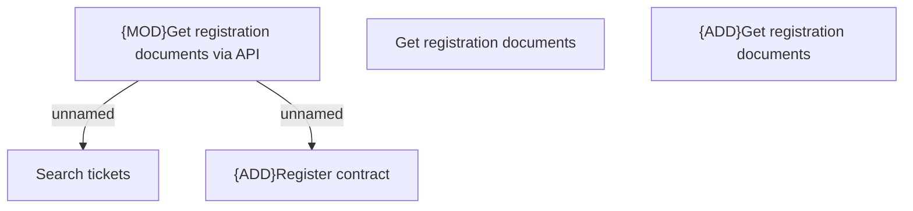

# Access Rights

- **Diagram Type**: Custom
- **Package**: HomerSelect/BSL/Modules/Registration module (REM)/Analytical model/Registrations/Contracts/Registration documents management/Get registration documents/Access Rights
- **Diagram ID**: 156840
- **Elements**: 5
- **Connectors**: 2

