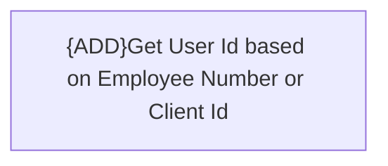

# Business Rules

- **Diagram Type**: Custom
- **Package**: HomerSelect/BSL/Modules/Registration module (REM)/Analytical model/Registrations/Contracts/Registration documents management/Get registration documents/Business Rules
- **Diagram ID**: 156841
- **Elements**: 1
- **Connectors**: 0

