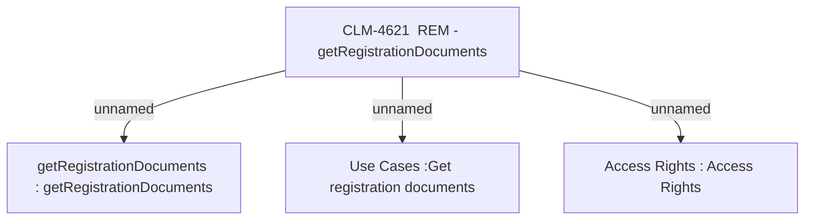

# CBL-16401 (CLM-4621) Post activation docs review - REM - getRegistrationDocuments

- **Diagram Type**: Custom
- **Package**: HomerSelect/BSL/Modules/Registration module (REM)/Requirements/CBL-16401 (CLM-4621) Post activation docs review - REM - getRegistrationDocuments
- **Diagram ID**: 156782
- **Elements**: 4
- **Connectors**: 3

