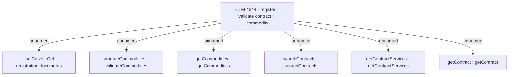

# CBL-16401 (CLM-4644) Post activation docs review - REM - register - validate contract + commodities

- **Diagram Type**: Custom
- **Package**: HomerSelect/BSL/Modules/Registration module (REM)/Requirements/CBL-16401 (CLM-4644) Post activation docs review - REM - register - validate contract + commodity
- **Diagram ID**: 156788
- **Elements**: 7
- **Connectors**: 6

