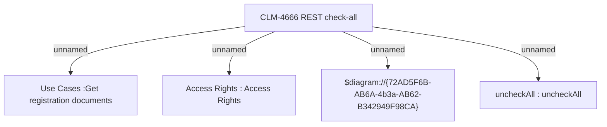

# CBL-16401 (CLM-4666) Post activation docs review - REM - REST check-all

- **Diagram Type**: Custom
- **Package**: HomerSelect/BSL/Modules/Registration module (REM)/Requirements/CBL-16401 (CLM-4666) Post activation docs review - REM - REST check-all
- **Diagram ID**: 156783
- **Elements**: 5
- **Connectors**: 4

