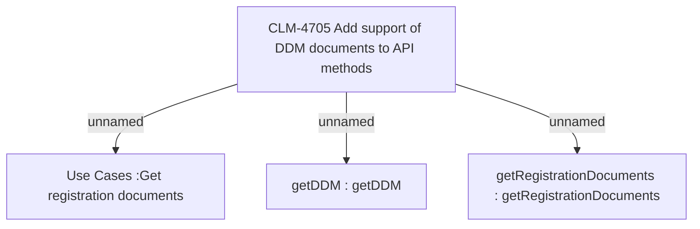

# CBL-16401 (CLM-4705) Post activation docs review - REM - add support of DDM documents to API methods

- **Diagram Type**: Custom
- **Package**: HomerSelect/BSL/Modules/Registration module (REM)/Requirements/CBL-16401 (CLM-4705) Post activation docs review - REM - add support of DDM documents to API methods
- **Diagram ID**: 156789
- **Elements**: 4
- **Connectors**: 3

