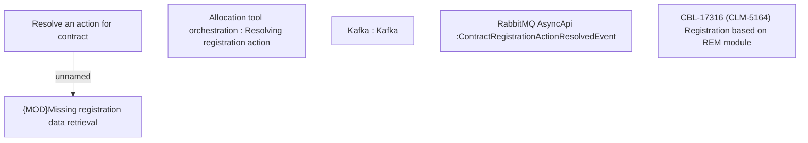

# CBL-17316 (CLM-5164) Registration based on REM module

```mermaid
graph TD
    MOD_Missing_registration_data_retrieval["{MOD}Missing registration data retrieval"]
    Resolve_an_action_for_contract["Resolve an action for contract"]
    Allocation_tool_orchestration_Resolving_registration_action["Allocation tool orchestration : Resolving registration action"]
    Kafka_Kafka["Kafka : Kafka"]
    RabbitMQ_AsyncApi_ContractRegistrationActionResolvedEvent["RabbitMQ AsyncApi :ContractRegistrationActionResolvedEvent"]
    CBL_17316_CLM_5164_Registration_based_on_REM_module["CBL-17316 (CLM-5164) Registration based on REM module"]
    Resolve_an_action_for_contract -->|unnamed| MOD_Missing_registration_data_retrieval
```
