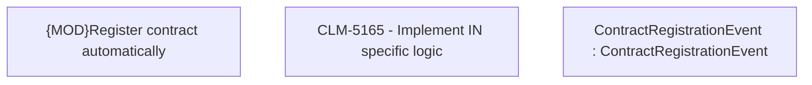

# CLM-5165 - Implement IN specific logic

- **Diagram Type**: Custom
- **Package**: HomerSelect/BSL/Modules/Registration module (REM)/Requirements/CBL-17316 (CLM-5164) Registration based on REM module/CLM-5165 - Implement IN specific logic
- **Diagram ID**: 156798
- **Elements**: 3
- **Connectors**: 0

