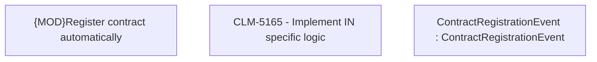

# CLM-5165 - Implement IN specific logic

```mermaid
graph TD
    MOD_Register_contract_automatically["{MOD}Register contract automatically"]
    CLM_5165_Implement_IN_specific_logic["CLM-5165 - Implement IN specific logic"]
    ContractRegistrationEvent_ContractRegistrationEvent["ContractRegistrationEvent : ContractRegistrationEvent"]
```
