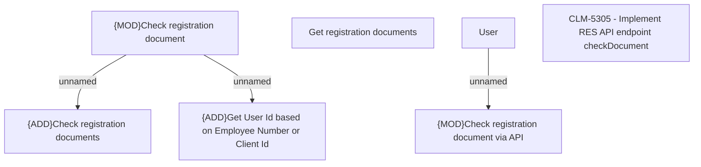

# CLM-5305 - REST API checkDocument

- **Diagram Type**: Custom
- **Package**: HomerSelect/BSL/Modules/Registration module (REM)/Requirements/CBL-19687/CLM-5305 - REST API checkDocument
- **Diagram ID**: 156799
- **Elements**: 7
- **Connectors**: 3

