# CBL-19696 (CSI-2724) DMS integration - Contract detail - Registration tab

- **Diagram Type**: Custom
- **Package**: HomerSelect/BSL/Modules/Registration module (REM)/Requirements/CBL-19696 (CSI-2724) DMS integration - Contract detail - Registration tab
- **Diagram ID**: 156785
- **Elements**: 12
- **Connectors**: 0

```mermaid
graph TD
    MOD_Check_registration_document["{MOD}Check registration document"]
    MOD_Uncheck_all_registration_documents["{MOD}Uncheck all registration documents"]
    MOD_Check_all_registration_documents["{MOD}Check all registration documents"]
    ADD_Get_registration["{ADD}Get registration"]
    getRegistration_getRegistration["getRegistration : getRegistration"]
    Registration_management_Registration_management_API["Registration management : Registration management API"]
    Get_registration_documents["Get registration documents"]
    getRegistrationDocuments_getRegistrationDocuments["getRegistrationDocuments : getRegistrationDocuments"]
    uncheckAll_uncheckAll["uncheckAll : uncheckAll"]
    checkAll_checkAll["checkAll : checkAll"]
    checkDocument_checkDocument["checkDocument : checkDocument"]
    CBL_19696_CSI_2724_DMS_integration_Contract_detail_Registrat["CBL-19696 (CSI-2724) DMS integration - Contract detail - Registration tab"]
```

