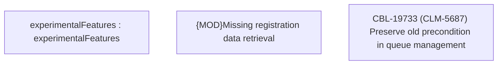

# CBL-19733 (CLM-5687) Preserve old precondition in queue management

- **Diagram Type**: Custom
- **Package**: HomerSelect/BSL/Modules/Registration module (REM)/Requirements/CBL-19733 (CLM-5687) Preserve old precondition in queue management
- **Diagram ID**: 156786
- **Elements**: 3
- **Connectors**: 0

