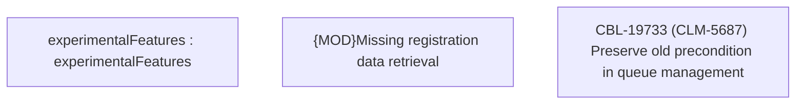

# CBL-19733 (CLM-5687) Preserve old precondition in queue management

```mermaid
graph TD
    experimentalFeatures_experimentalFeatures["experimentalFeatures : experimentalFeatures"]
    MOD_Missing_registration_data_retrieval["{MOD}Missing registration data retrieval"]
    CBL_19733_CLM_5687_Preserve_old_precondition_in_queue_manage["CBL-19733 (CLM-5687) Preserve old precondition in queue management"]
```
