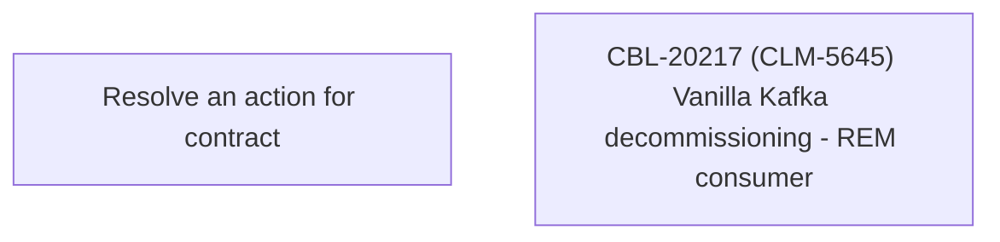

# CBL-20217 (CLM-5645) Vanilla Kafka decommissioning - REM consumer

- **Diagram Type**: Custom
- **Package**: HomerSelect/BSL/Modules/Registration module (REM)/Requirements/CBL-20217 (CLM-5645) Vanilla Kafka decommissioning - REM consumer
- **Diagram ID**: 156787
- **Elements**: 2
- **Connectors**: 0

