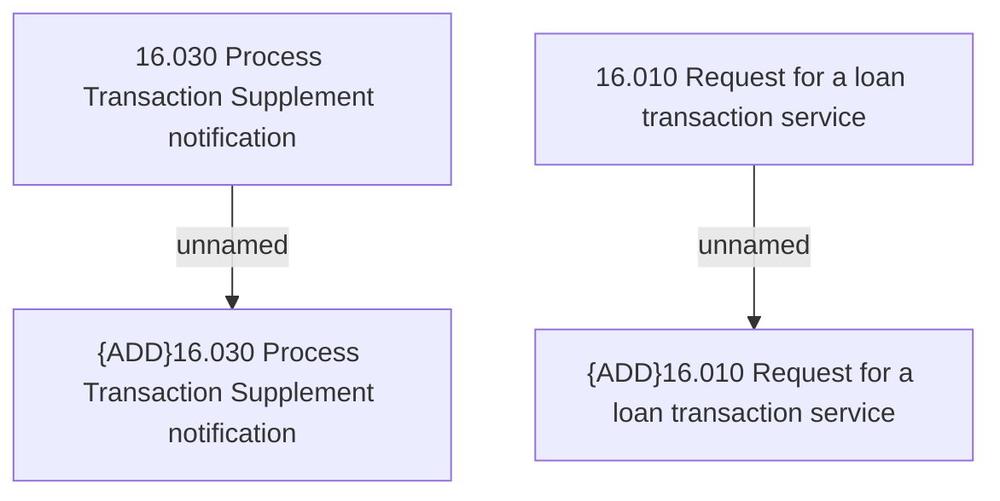

# Access Rights

```mermaid
graph TD
    ADD_16_030_Process_Transaction_Supplement_notification["{ADD}16.030 Process Transaction Supplement notification"]
    n_16_030_Process_Transaction_Supplement_notification["16.030 Process Transaction Supplement notification"]
    ADD_16_010_Request_for_a_loan_transaction_service["{ADD}16.010 Request for a loan transaction service"]
    n_16_010_Request_for_a_loan_transaction_service["16.010 Request for a loan transaction service"]
    n_16_010_Request_for_a_loan_transaction_service -->|unnamed| ADD_16_010_Request_for_a_loan_transaction_service
    n_16_030_Process_Transaction_Supplement_notification -->|unnamed| ADD_16_030_Process_Transaction_Supplement_notification
```
