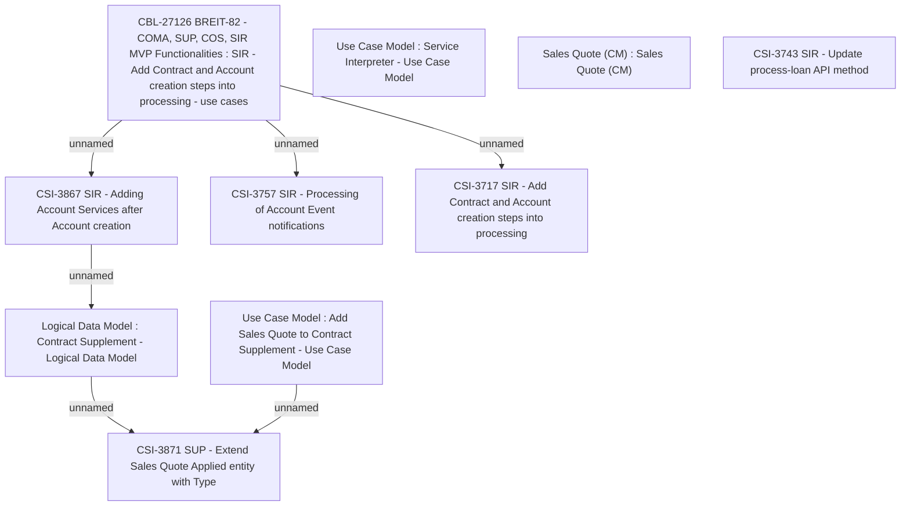

# CBL-27126 BREIT-82 - COMA, SUP, COS, SIR MVP Functionalities

```mermaid
graph TD
    Logical_Data_Model_Contract_Supplement_Logical_Data_Model["Logical Data Model : Contract Supplement - Logical Data Model"]
    Use_Case_Model_Add_Sales_Quote_to_Contract_Supplement_Use_Ca["Use Case Model : Add Sales Quote to Contract Supplement - Use Case Model"]
    CSI_3871_SUP_Extend_Sales_Quote_Applied_entity_with_Type["CSI-3871 SUP - Extend Sales Quote Applied entity with Type"]
    Logical_Data_Model_Contract_Supplement_Logical_Data_Model["Logical Data Model : Contract Supplement - Logical Data Model"]
    CSI_3867_SIR_Adding_Account_Services_after_Account_creation["CSI-3867 SIR - Adding Account Services after Account creation"]
    CBL_27126_BREIT_82_COMA_SUP_COS_SIR_MVP_Functionalities_SIR_["CBL-27126 BREIT-82 - COMA, SUP, COS, SIR MVP Functionalities :SIR - Processing of Account Event notifications"]
    CBL_27126_BREIT_82_COMA_SUP_COS_SIR_MVP_Functionalities_SIR_["CBL-27126 BREIT-82 - COMA, SUP, COS, SIR MVP Functionalities : SIR - Add Contract and Account creation steps into processing - use cases"]
    CSI_3757_SIR_Processing_of_Account_Event_notifications["CSI-3757 SIR - Processing of Account Event notifications"]
    Use_Case_Model_Service_Interpreter_Use_Case_Model["Use Case Model : Service Interpreter - Use Case Model"]
    Sales_Quote_CM_Sales_Quote_CM["Sales Quote (CM) : Sales Quote (CM)"]
    CSI_3717_SIR_Add_Contract_and_Account_creation_steps_into_pr["CSI-3717 SIR - Add Contract and Account creation steps into processing"]
    CSI_3743_SIR_Update_process_loan_API_method["CSI-3743 SIR - Update process-loan API method"]
    CBL_27126_BREIT_82_COMA_SUP_COS_SIR_MVP_Functionalities_SIR_ -->|unnamed| CSI_3717_SIR_Add_Contract_and_Account_creation_steps_into_pr
    CBL_27126_BREIT_82_COMA_SUP_COS_SIR_MVP_Functionalities_SIR_ -->|unnamed| CSI_3757_SIR_Processing_of_Account_Event_notifications
    CBL_27126_BREIT_82_COMA_SUP_COS_SIR_MVP_Functionalities_SIR_ -->|unnamed| CSI_3867_SIR_Adding_Account_Services_after_Account_creation
    CSI_3867_SIR_Adding_Account_Services_after_Account_creation -->|unnamed| Logical_Data_Model_Contract_Supplement_Logical_Data_Model
    Logical_Data_Model_Contract_Supplement_Logical_Data_Model -->|unnamed| CSI_3871_SUP_Extend_Sales_Quote_Applied_entity_with_Type
    Use_Case_Model_Add_Sales_Quote_to_Contract_Supplement_Use_Ca -->|unnamed| CSI_3871_SUP_Extend_Sales_Quote_Applied_entity_with_Type
```
