# CBL-28824 DOBA-76 Contract management - SIR, SUP, COMA, COS

- **Diagram Type**: Custom
- **Package**: HomerSelect/BSL/Modules/Service Interpreter (SIR_NG)/Requirement Model/CBL-28824 DOBA-76 Contract management - SIR, SUP, COMA, COS
- **Diagram ID**: 163689
- **Elements**: 12
- **Connectors**: 7

```mermaid
graph TD
    Use_Case_Model_Account_origination_Use_Case_Model["Use Case Model : Account origination - Use Case Model"]
    Use_Case_Model_Accept_Contract_Supplement_Documents_Use_Case["Use Case Model : Accept Contract Supplement Documents - Use Case Model"]
    DOBA_351_Cancel_Contract_agreement_Customer_rejects_flow["DOBA-351 Cancel Contract agreement - Customer rejects flow"]
    DOBA_179_SIR_Process_Account_Activated_notification["DOBA-179 SIR - Process Account Activated notification"]
    Use_Case_Model_Account_origination_Use_Case_Model["Use Case Model : Account origination - Use Case Model"]
    DOBA_177_SIR_Account_activation["DOBA-177 SIR - Account activation"]
    Logical_Data_Model_Supplement_definition_Logical_Data_Model["Logical Data Model : Supplement definition - Logical Data Model"]
    Getting_Supplement_definition_service_Find_Supplement_defini["Getting Supplement definition service : Find Supplement definition service"]
    DOBA_129_SUP_Add_autorizeTransaction_flag_to_Supplement_defi["DOBA-129 SUP - Add autorizeTransaction flag to Supplement definition"]
    CBL_28824_DOBA_76_Contract_management_SIR_SUP_COMA_COS_SIR_P["CBL-28824 DOBA-76 Contract management - SIR, SUP, COMA, COS : SIR - Process Sales Quotes for Transaction"]
    Sales_Quote_CM_Sales_Quote_CM["Sales Quote (CM) : Sales Quote (CM)"]
    DOBA_78_SIR_Process_Sales_Quotes_for_Transaction["DOBA-78 SIR - Process Sales Quotes for Transaction"]
    Use_Case_Model_Accept_Contract_Supplement_Documents_Use_Case -->|unnamed| DOBA_351_Cancel_Contract_agreement_Customer_rejects_flow
    Use_Case_Model_Account_origination_Use_Case_Model -->|unnamed| DOBA_351_Cancel_Contract_agreement_Customer_rejects_flow
    DOBA_78_SIR_Process_Sales_Quotes_for_Transaction -->|unnamed| CBL_28824_DOBA_76_Contract_management_SIR_SUP_COMA_COS_SIR_P
    Logical_Data_Model_Supplement_definition_Logical_Data_Model -->|unnamed| DOBA_129_SUP_Add_autorizeTransaction_flag_to_Supplement_defi
    Getting_Supplement_definition_service_Find_Supplement_defini -->|unnamed| DOBA_129_SUP_Add_autorizeTransaction_flag_to_Supplement_defi
    Use_Case_Model_Account_origination_Use_Case_Model -->|unnamed| DOBA_177_SIR_Account_activation
    Use_Case_Model_Account_origination_Use_Case_Model -->|unnamed| DOBA_179_SIR_Process_Account_Activated_notification
```

