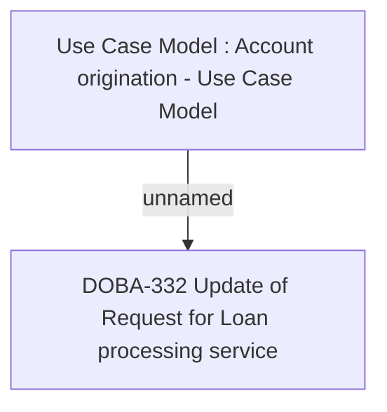

# CBL-29554 (DOBA-220) Allow CONTRACT to have multiple Accounts

```mermaid
graph TD
    Use_Case_Model_Account_origination_Use_Case_Model["Use Case Model : Account origination - Use Case Model"]
    DOBA_332_Update_of_Request_for_Loan_processing_service["DOBA-332 Update of Request for Loan processing service"]
    Use_Case_Model_Account_origination_Use_Case_Model -->|unnamed| DOBA_332_Update_of_Request_for_Loan_processing_service
```
