# Access Rights

- **Diagram Type**: Custom
- **Package**: HomerSelect/BSL/Modules/Supplements (SUP_NG)/Analytical Model/Contract Supplements/Access Rights
- **Diagram ID**: 160070
- **Elements**: 16
- **Connectors**: 8

```mermaid
graph TD
    ADD_13_025_Authorize_transactions_in_Contract_Supplement["{ADD}13.025 Authorize transactions in Contract Supplement"]
    ADD_13_025_Authorize_transactions_in_Contract_Supplement["{ADD}13.025 Authorize transactions in Contract Supplement"]
    ADD_13_050_Cancel_Contract_Supplement["{ADD}13.050 Cancel Contract Supplement"]
    n_13_050_Cancel_Contract_Supplement["13.050 Cancel Contract Supplement"]
    ADD_13_040_Accept_Contract_Supplement_Documents["{ADD}13.040 Accept Contract Supplement Documents"]
    n_13_040_Accept_Contract_Supplement_Documents["13.040 Accept Contract Supplement Documents"]
    ADD_13_110_Find_Contract_Supplements["{ADD}13.110 Find Contract Supplements"]
    ADD_13_100_Get_Contract_Supplement["{ADD}13.100 Get Contract Supplement"]
    MOD_13_110_Find_Contract_Supplements["{MOD}13.110 Find Contract Supplements"]
    ADD_13_100_Get_Contract_Supplement["{ADD}13.100 Get Contract Supplement"]
    ADD_13_030_Create_Document_to_Contract_Supplement["{ADD}13.030 Create Document to Contract Supplement"]
    n_13_030_Create_Document_to_Contract_Supplement["13.030 Create Document to Contract Supplement"]
    ADD_13_020_Add_Sales_Quote_to_Contract_Supplement["{ADD}13.020 Add Sales Quote to Contract Supplement"]
    n_13_020_Add_Sales_Quote_to_Contract_Supplement["13.020 Add Sales Quote to Contract Supplement"]
    ADD_13_010_Create_Contract_Supplement["{ADD}13.010 Create Contract Supplement"]
    n_13_010_Create_Contract_Supplement["13.010 Create Contract Supplement"]
    n_13_010_Create_Contract_Supplement -->|unnamed| ADD_13_010_Create_Contract_Supplement
    n_13_020_Add_Sales_Quote_to_Contract_Supplement -->|unnamed| ADD_13_020_Add_Sales_Quote_to_Contract_Supplement
    n_13_050_Cancel_Contract_Supplement -->|unnamed| ADD_13_050_Cancel_Contract_Supplement
    MOD_13_110_Find_Contract_Supplements -->|unnamed| ADD_13_110_Find_Contract_Supplements
    n_13_030_Create_Document_to_Contract_Supplement -->|unnamed| ADD_13_030_Create_Document_to_Contract_Supplement
    n_13_040_Accept_Contract_Supplement_Documents -->|unnamed| ADD_13_040_Accept_Contract_Supplement_Documents
    ADD_13_025_Authorize_transactions_in_Contract_Supplement -->|unnamed| ADD_13_025_Authorize_transactions_in_Contract_Supplement
    ADD_13_100_Get_Contract_Supplement -->|unnamed| ADD_13_100_Get_Contract_Supplement
```

