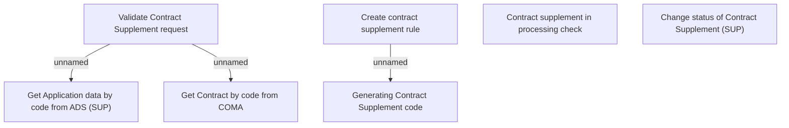

# Business Rules

```mermaid
graph TD
    Get_Contract_by_code_from_COMA["Get Contract by code from COMA"]
    Validate_Contract_Supplement_request["Validate Contract Supplement request"]
    Get_Application_data_by_code_from_ADS_SUP["Get Application data by code from ADS (SUP)"]
    Generating_Contract_Supplement_code["Generating Contract Supplement code"]
    Create_contract_supplement_rule["Create contract supplement rule"]
    Contract_supplement_in_processing_check["Contract supplement in processing check"]
    Change_status_of_Contract_Supplement_SUP["Change status of Contract Supplement (SUP)"]
    Create_contract_supplement_rule -->|unnamed| Generating_Contract_Supplement_code
    Validate_Contract_Supplement_request -->|unnamed| Get_Application_data_by_code_from_ADS_SUP
    Validate_Contract_Supplement_request -->|unnamed| Get_Contract_by_code_from_COMA
```
