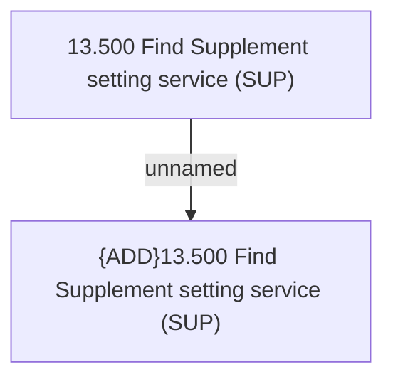

# Access Rights

- **Diagram Type**: Custom
- **Package**: HomerSelect/BSL/Modules/Supplements (SUP_NG)/Analytical Model/Supplement definition/Access Rights
- **Diagram ID**: 157972
- **Elements**: 2
- **Connectors**: 1

