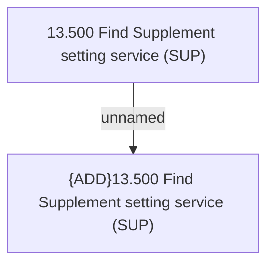

# Access Rights

```mermaid
graph TD
    n_13_500_Find_Supplement_setting_service_SUP["13.500 Find Supplement setting service (SUP)"]
    ADD_13_500_Find_Supplement_setting_service_SUP["{ADD}13.500 Find Supplement setting service (SUP)"]
    n_13_500_Find_Supplement_setting_service_SUP -->|unnamed| ADD_13_500_Find_Supplement_setting_service_SUP
```
