# CBL-25004 (CSI-3390) SME Contract and Document Management

- **Diagram Type**: Custom
- **Package**: HomerSelect/BSL/Modules/Supplements (SUP_NG)/Requirement Model/CBL-25004 (CSI-3390) SME Contract and Document Management
- **Diagram ID**: 158780
- **Elements**: 19
- **Connectors**: 10

```mermaid
graph TD
    Contract_Supplement_notifications_Contract_Supplement_notifi["Contract Supplement notifications : Contract Supplement notifications"]
    CSI_3458_SUP_Generate_notifications_about_Contract_Supplemen["CSI-3458 SUP - Generate notifications about Contract Supplement events"]
    Use_Case_Model_Cancel_Contract_Supplement_Use_case_model["Use Case Model : Cancel Contract Supplement - Use case model"]
    CSI_3503_SUP_Cancellation_of_Contract_Supplement["CSI-3503 SUP - Cancellation of Contract Supplement"]
    Use_Case_Model_Adding_Service_to_Contract_Use_Case_Model["Use Case Model : Adding Service to Contract - Use Case Model"]
    Contract_Services_Adding_Loan_Service_to_Contract_method_COS["Contract Services : Adding Loan Service to Contract method (COS)"]
    Contract_Service_Notifications_Contract_Service_Notification["Contract Service Notifications : Contract Service Notifications"]
    CSI_3450_COS_Extension_of_Create_Contract_Service_method_for["CSI-3450 COS - Extension of Create Contract Service method for entering Service Roles"]
    CSI_3451_COS_Extension_of_ContractService_notifications_with["CSI-3451 COS - Extension of ContractService notifications with Service Roles "]
    Use_Case_Model_Get_Contract_Supplements_Use_Case_Model["Use Case Model : Get Contract Supplements - Use Case Model"]
    CSI_3454_SUP_Getting_Contract_Supplements_methods["CSI-3454 SUP - Getting Contract Supplements methods"]
    Use_Case_Model_Accept_Contract_Supplement_Documents_Use_Case["Use Case Model : Accept Contract Supplement Documents - Use Case Model"]
    CSI_3452_SUP_Accept_Contract_Supplement_Documentation["CSI-3452 SUP - Accept Contract Supplement Documentation"]
    Use_Case_Model_Create_Contract_Supplement_documents_Use_Case["Use Case Model : Create Contract Supplement documents - Use Case Model"]
    CSI_3415_SUP_Generate_Contract_Supplement_Document["CSI-3415 SUP - Generate Contract Supplement Document"]
    Use_Case_Model_Add_Sales_Quote_to_Contract_Supplement_Use_Ca["Use Case Model : Add Sales Quote to Contract Supplement - Use Case Model"]
    Use_Case_Model_Create_Contract_Service_Supplement_Use_Case_M["Use Case Model : Create Contract Service Supplement - Use Case Model"]
    CSI_3397_SUP_Add_Sales_Quote_to_the_Contract_Supplement["CSI-3397 SUP - Add Sales Quote to the Contract Supplement"]
    CSI_3390_SUP_Create_Contract_Service_Supplement["CSI-3390 SUP - Create Contract Service Supplement"]
    Contract_Supplement_notifications_Contract_Supplement_notifi -->|unnamed| CSI_3458_SUP_Generate_notifications_about_Contract_Supplemen
    Use_Case_Model_Cancel_Contract_Supplement_Use_case_model -->|unnamed| CSI_3503_SUP_Cancellation_of_Contract_Supplement
    Use_Case_Model_Create_Contract_Service_Supplement_Use_Case_M -->|unnamed| CSI_3390_SUP_Create_Contract_Service_Supplement
    Use_Case_Model_Add_Sales_Quote_to_Contract_Supplement_Use_Ca -->|unnamed| CSI_3397_SUP_Add_Sales_Quote_to_the_Contract_Supplement
    Use_Case_Model_Create_Contract_Supplement_documents_Use_Case -->|unnamed| CSI_3415_SUP_Generate_Contract_Supplement_Document
    Use_Case_Model_Accept_Contract_Supplement_Documents_Use_Case -->|unnamed| CSI_3452_SUP_Accept_Contract_Supplement_Documentation
    Use_Case_Model_Get_Contract_Supplements_Use_Case_Model -->|unnamed| CSI_3454_SUP_Getting_Contract_Supplements_methods
    Contract_Service_Notifications_Contract_Service_Notification -->|unnamed| CSI_3451_COS_Extension_of_ContractService_notifications_with
    Use_Case_Model_Adding_Service_to_Contract_Use_Case_Model -->|unnamed| CSI_3450_COS_Extension_of_Create_Contract_Service_method_for
    Contract_Services_Adding_Loan_Service_to_Contract_method_COS -->|unnamed| CSI_3450_COS_Extension_of_Create_Contract_Service_method_for
```

