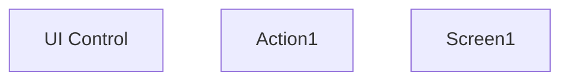

# UI model

- **Diagram Type**: Custom
- **Package**: HomerSelect/BSL/Modules/Supplements (SUP_NG)/Requirement Model/CBL-25004 (CSI-3390) SME Contract and Document Management/UI model
- **Diagram ID**: 158685
- **Elements**: 3
- **Connectors**: 0

