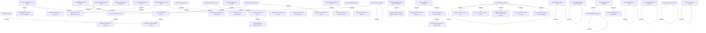

# Access rights

- **Diagram Type**: Custom
- **Package**: HomerSelect/BSL/Modules/Ticketing (TCK)/Analytical Model/Access rights
- **Diagram ID**: 157456
- **Elements**: 60
- **Connectors**: 41

```mermaid
graph TD
    n_10_019_Unassign_user_from_queue["10.019 Unassign user from queue"]
    n_10_017_Get_queue["10.017 Get queue"]
    n_10_018_Assign_user_into_queue["10.018 Assign user into queue"]
    ADD_10_019_Unassign_user_from_queue["{ADD}10.019 Unassign user from queue"]
    ADD_10_018_Assign_user_into_queue["{ADD}10.018 Assign user into queue"]
    ADD_10_100_Show_My_overview["{ADD}10.100 Show My overview"]
    n_10_100_Show_My_overview["10.100 Show My overview"]
    ADD_10_092_Queue_detail_screen["{ADD}10.092 Queue detail screen"]
    ADD_10_091_User_queue_management["{ADD}10.091 User queue management"]
    MOD_10_090_Ticket_dashboard_screen["{MOD}10.090 Ticket dashboard screen"]
    Show_Queues_and_tickets_screen["Show Queues and tickets screen"]
    ADD_10_025_List_departments["{ADD}10.025 List departments"]
    ADD_10_038_Get_department_users["{ADD}10.038 Get department users"]
    n_10_025_List_departments["10.025 List departments"]
    n_10_038_Get_department_users["10.038 Get department users"]
    n_10_063_Unassign_ticket_from_user["10.063 Unassign ticket from user"]
    n_10_062_Assign_ticket_to_user["10.062 Assign ticket to user"]
    n_10_061_Assign_a_ticket_from_queue["10.061 Assign a ticket from queue"]
    n_10_033_Remove_ticket_from_queue["10.033 Remove ticket from queue"]
    n_10_031_Get_ticket_queues["10.031 Get ticket queues"]
    n_10_017_Get_available_queues["10.017 Get available queues"]
    n_10_032_Add_ticket_to_queue["10.032 Add ticket to queue"]
    ADD_10_063_Unassign_ticket_from_user["{ADD}10.063 Unassign ticket from user"]
    ADD_10_062_Assign_ticket_to_user["{ADD}10.062 Assign ticket to user"]
    ADD_10_061_Assign_ticket_from_queue["{ADD}10.061 Assign ticket from queue"]
    ADD_10_033_Remove_ticket_from_queue["{ADD}10.033 Remove ticket from queue"]
    ADD_10_032_Add_ticket_to_queue["{ADD}10.032 Add ticket to queue"]
    ADD_10_031_Get_ticket_queues["{ADD}10.031 Get ticket queues"]
    ADD_10_017_Get_available_Queues["{ADD}10.017 Get available Queues"]
    ADD_10_010_Search_for_tickets_person_with_limitation["{ADD}10.010 Search for tickets - person with limitation"]
    ADD_10_039_Get_Mistake_Tickets_Count_on_Contracts["{ADD}10.039 Get Mistake Tickets Count on Contracts"]
    n_10_039_Get_Mistake_Tickets_Count_on_Contracts["10.039 Get Mistake Tickets Count on Contracts"]
    n_10_053_Create_ticket_revision_service["10.053 Create ticket revision service"]
    ADD_10_053_Create_ticket_revision_service["{ADD}10.053 Create ticket revision service"]
    n_10_052_Revise_ticket_manually["10.052 Revise ticket manually"]
    ADD_10_052_Revise_ticket_manually["{ADD}10.052 Revise ticket manually"]
    n_10_051_Add_comment_to_ticket["10.051 Add comment to ticket"]
    n_10_051_Add_comment_to_ticket["10.051 Add comment to ticket"]
    n_10_071_Take_and_attach_photo_file_to_ticket["10.071 Take and attach photo file to ticket"]
    n_10_071_Take_and_attach_photo_file_to_ticket["10.071 Take and attach photo file to ticket"]
    n_10_010_Search_for_tickets_POS_with_limitation["10.010 Search for tickets - POS with limitation"]
    n_10_080_Create_mistake_ticket["10.080 Create mistake ticket"]
    n_10_075_Download_a_ticket_attachment["10.075 Download a ticket attachment"]
    n_10_070_Attach_a_file_to_ticket["10.070 Attach a file to ticket"]
    n_10_010_Search_for_tickets_person["10.010 Search for tickets - person"]
    n_10_010_Search_for_tickets_POS["10.010 Search for tickets - POS"]
    n_10_010_Search_for_tickets_all_tickets["10.010 Search for tickets - all tickets"]
    n_10_060_Change_ticket_status["10.060 Change ticket status"]
    DEL_10_050_Assign_ticket_to_department["{DEL}10.050 Assign ticket to department"]
    n_10_030_Show_ticket_detail["10.030 Show ticket detail"]
    n_10_020_Create_ticket_manually["10.020 Create ticket manually"]
    n_10_010_Search_for_tickets["10.010 Search for tickets"]
    n_10_075_Download_a_ticket_attachment["10.075 Download a ticket attachment"]
    n_10_070_Attach_a_file_to_ticket["10.070 Attach a file to ticket"]
    n_10_060_Change_ticket_status["10.060 Change ticket status"]
    n_10_050_Assign_ticket_to_department["10.050 Assign ticket to department"]
    n_10_030_Show_ticket_detail["10.030 Show ticket detail"]
    n_10_020_Create_ticket_manually["10.020 Create ticket manually"]
    n_10_010_Search_for_tickets["10.010 Search for tickets"]
    n_10_080_Create_mistake_ticket["10.080 Create mistake ticket"]
    n_10_030_Show_ticket_detail -->|unnamed| n_10_100_Show_My_overview
    n_10_030_Show_ticket_detail -->|unnamed| n_10_030_Show_ticket_detail
    n_10_063_Unassign_ticket_from_user -->|unnamed| ADD_10_063_Unassign_ticket_from_user
    n_10_019_Unassign_user_from_queue -->|unnamed| ADD_10_019_Unassign_user_from_queue
    n_10_019_Unassign_user_from_queue -->|unnamed| n_10_100_Show_My_overview
    n_10_017_Get_queue -->|unnamed| ADD_10_017_Get_available_Queues
    n_10_018_Assign_user_into_queue -->|unnamed| n_10_017_Get_available_queues
    n_10_017_Get_available_queues -->|unnamed| ADD_10_017_Get_available_Queues
    n_10_032_Add_ticket_to_queue -->|unnamed| n_10_017_Get_available_queues
    n_10_061_Assign_a_ticket_from_queue -->|unnamed| n_10_100_Show_My_overview
    n_10_061_Assign_a_ticket_from_queue -->|unnamed| ADD_10_061_Assign_ticket_from_queue
    n_10_060_Change_ticket_status -->|unnamed| n_10_060_Change_ticket_status
    n_10_031_Get_ticket_queues -->|unnamed| ADD_10_031_Get_ticket_queues
    n_10_100_Show_My_overview -->|unnamed| ADD_10_100_Show_My_overview
    n_10_018_Assign_user_into_queue -->|unnamed| n_10_100_Show_My_overview
    n_10_052_Revise_ticket_manually -->|unnamed| ADD_10_052_Revise_ticket_manually
    n_10_052_Revise_ticket_manually -->|unnamed| n_10_053_Create_ticket_revision_service
    n_10_062_Assign_ticket_to_user -->|unnamed| n_10_038_Get_department_users
    n_10_038_Get_department_users -->|unnamed| ADD_10_038_Get_department_users
    n_10_032_Add_ticket_to_queue -->|unnamed| ADD_10_032_Add_ticket_to_queue
    n_10_080_Create_mistake_ticket -->|unnamed| n_10_080_Create_mistake_ticket
    n_10_071_Take_and_attach_photo_file_to_ticket -->|unnamed| n_10_071_Take_and_attach_photo_file_to_ticket
    n_10_039_Get_Mistake_Tickets_Count_on_Contracts -->|unnamed| ADD_10_039_Get_Mistake_Tickets_Count_on_Contracts
    n_10_051_Add_comment_to_ticket -->|unnamed| n_10_051_Add_comment_to_ticket
    n_10_075_Download_a_ticket_attachment -->|unnamed| n_10_075_Download_a_ticket_attachment
    n_10_053_Create_ticket_revision_service -->|unnamed| ADD_10_053_Create_ticket_revision_service
    n_10_018_Assign_user_into_queue -->|unnamed| ADD_10_018_Assign_user_into_queue
    n_10_025_List_departments -->|unnamed| ADD_10_025_List_departments
    n_10_062_Assign_ticket_to_user -->|unnamed| ADD_10_062_Assign_ticket_to_user
    n_10_070_Attach_a_file_to_ticket -->|unnamed| n_10_070_Attach_a_file_to_ticket
    n_10_033_Remove_ticket_from_queue -->|unnamed| ADD_10_033_Remove_ticket_from_queue
    n_10_010_Search_for_tickets -->|unnamed| n_10_010_Search_for_tickets
    n_10_010_Search_for_tickets -->|unnamed| n_10_010_Search_for_tickets_POS
    n_10_010_Search_for_tickets -->|unnamed| n_10_010_Search_for_tickets_person
    n_10_010_Search_for_tickets -->|unnamed| ADD_10_010_Search_for_tickets_person_with_limitation
    n_10_010_Search_for_tickets -->|unnamed| n_10_010_Search_for_tickets_all_tickets
    n_10_010_Search_for_tickets -->|unnamed| n_10_010_Search_for_tickets_POS_with_limitation
    n_10_020_Create_ticket_manually -->|unnamed| n_10_020_Create_ticket_manually
    n_10_050_Assign_ticket_to_department -->|unnamed| n_10_060_Change_ticket_status
    n_10_050_Assign_ticket_to_department -->|unnamed| DEL_10_050_Assign_ticket_to_department
    Show_Queues_and_tickets_screen -->|unnamed| MOD_10_090_Ticket_dashboard_screen
```
