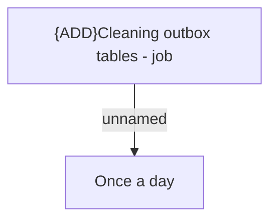

# Automatic jobs

- **Diagram Type**: Custom
- **Package**: HomerSelect/BSL/Modules/Ticketing (TCK)/Analytical Model/COMMON for Ticketing/Automatic jobs
- **Diagram ID**: 156191
- **Elements**: 2
- **Connectors**: 1

