# Business Rules

- **Diagram Type**: Custom
- **Package**: HomerSelect/BSL/Modules/Ticketing (TCK)/Analytical Model/COMMON for Ticketing/Business Rules
- **Diagram ID**: 162954
- **Elements**: 9
- **Connectors**: 0

```mermaid
graph TD
    Update_assignee["Update assignee"]
    Redirect_links_rule["Redirect links rule"]
    Check_that_an_authenticated_user_exists["Check that an authenticated user exists
"]
    ADD_Get_salesroom_from_contract["{ADD}Get salesroom from contract"]
    Generate_Ticket_changed_notification["Generate Ticket changed notification"]
    Generate_Related_subject_notification["Generate Related subject notification"]
    Extract_parts_from_ticket_code["Extract parts from ticket code"]
    Generate_notification_about_Ticket_status_change["Generate notification about Ticket status change"]
    Authorization_of_user_to_perform_an_action_rule["Authorization of user to perform an action rule"]
```

