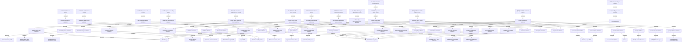

# Validation rules

```mermaid
graph TD
    ADD_LONG_data_type["{ADD}LONG data type"]
    CustomerCode_validation["CustomerCode validation"]
    Allowed_filename_extensions["Allowed filename extensions"]
    n_10_053_Create_ticket_revision_service["10.053 Create ticket revision service"]
    Filename_extension_format["Filename extension format"]
    Filename_Extension_validation["Filename Extension validation"]
    TypeSpecification_enumeration_value["TypeSpecification enumeration value"]
    TypeSpecification_validation["TypeSpecification validation"]
    n_10_038_Get_ticket_type_specification_service["10.038 Get ticket type specification service"]
    Get_Ticket_Type_Specification_service_validation["Get Ticket Type Specification service validation"]
    Printable_text_1_up_18["Printable text 1 up 18"]
    Printable_text_1_up_255["Printable text 1 up 255"]
    UserSettingItemType_validation["UserSettingItemType validation"]
    UserSettingValue_validation["UserSettingValue validation"]
    Update_user_setting_service_validation["Update user setting service validation"]
    n_10_036_Update_user_setting_service["10.036 Update user setting service"]
    Get_ticketCounts_service_validations["Get ticketCounts service validations"]
    n_10_035_Get_ticket_counts_service["10.035 Get ticket counts service"]
    communicationRecordCode_validation["communicationRecordCode validation"]
    ContractSupplementCode_validation["ContractSupplementCode validation"]
    RelatedSubject_code_validation["RelatedSubject code validation"]
    RelatedSubjectType_validation["RelatedSubjectType validation"]
    RelatedSubjectType_enumeration_validation["RelatedSubjectType enumeration validation"]
    Create_related_subject_to_ticket_validations["Create related subject to ticket validations"]
    n_10_034_Create_related_subject_to_ticket_service["10.034 Create related subject to ticket service"]
    FileSize_validation["FileSize validation"]
    Up_to_1MB["Up to 1MB."]
    SearchType_enumeration_value["SearchType enumeration value"]
    searchType_validation["searchType validation"]
    ArrangedOnSalesroom_validation["ArrangedOnSalesroom validation"]
    ArrangedBy_validation["ArrangedBy validation"]
    ContractCode_validation["ContractCode validation"]
    DocumentExternalId_validation["DocumentExternalId validation"]
    Ticket_code_validation["Ticket code validation"]
    DocumentTypeCode_validation["DocumentTypeCode validation"]
    MistakeRuleType_enumeration_value["MistakeRuleType enumeration value"]
    MistakeRuleType_validation["MistakeRuleType validation"]
    Printable_text_1_up_30["Printable text 1 up 30"]
    ContractPackageCode_validation["ContractPackageCode validation"]
    Get_Mistake_Rules_service_validations["Get Mistake Rules service validations"]
    n_10_085_Get_Mistake_Rules_service["10.085 Get Mistake Rules service"]
    Attach_a_file_to_ticket_service_validations["Attach a file to ticket service validations"]
    n_10_072_Attach_a_file_to_ticket_service["10.072 Attach a file to ticket service"]
    Comment_validation["Comment validation"]
    FileName_validation["FileName validation"]
    Change_ticket_status_service_validations["Change ticket status service validations"]
    n_10_062_Change_ticket_status_service["10.062 Change ticket status service"]
    Get_ticket_rules_service_validation["Get ticket rules service validation"]
    n_10_028_Get_ticket_rules_service["10.028 Get ticket rules service"]
    Printable_text_5_up_to_255["Printable text 5 up to 255"]
    Get_available_Departments_service_validation["Get available Departments service validation"]
    n_10_025_Get_available_Departments_service["10.025 Get available Departments service"]
    Category_enumeration_value["Category enumeration value"]
    Category_validation["Category validation"]
    Get_Ticket_Types_service_validation["Get Ticket Types service validation"]
    n_10_024_Get_Ticket_Types_service["10.024 Get Ticket Types service"]
    Show_ticket_detail_service_validation["Show ticket detail service validation"]
    n_10_032_Show_ticket_detail_service["10.032 Show ticket detail service"]
    Department_validation["Department validation"]
    Status_validation["Status validation"]
    Type_validation["Type validation"]
    Priority_validation["Priority validation"]
    Search_for_tickets_service_validations["Search for tickets service validations"]
    MOD_10_012_Search_for_tickets_service["{MOD}10.012 Search for tickets service"]
    ResolutionTime_validation["ResolutionTime validation"]
    ResponseTime_validation["ResponseTime validation"]
    Description_validation["Description validation"]
    Create_ticket_service_validations["Create ticket service validations"]
    Date_cannot_be_in_future["Date cannot be in future"]
    Date["Date"]
    Creation_date_validation["Creation date validation"]
    Ticket_code_mandatory_validation["Ticket code (mandatory) validation"]
    MOD_10_022_Create_ticket_service["{MOD}10.022 Create ticket service"]
    Department_enumeration_value["Department enumeration value"]
    Priority_enumeration_value["Priority enumeration value"]
    Type_enumeration_value["Type enumeration value"]
    Status_enumeration_value["Status enumeration value"]
    Printable_text_10_up_to_60["Printable text 10 up to 60"]
    Printable_text_0_2047_characters["Printable text 0 - 2047 characters"]
    Number_1_up_to_9999["Number 1 up to 9999"]
    Mandatory["Mandatory"]
    Get_Ticket_Types_service_validation -->|unnamed| Category_validation
    Create_ticket_service_validations -->|unnamed| Department_validation
    Create_ticket_service_validations -->|unnamed| Description_validation
    Change_ticket_status_service_validations -->|unnamed| Status_validation
    Search_for_tickets_service_validations -->|unnamed| Status_validation
    Get_Ticket_Type_Specification_service_validation -->|unnamed| Type_validation
    Create_ticket_service_validations -->|unnamed| Type_validation
    Get_available_Departments_service_validation -->|unnamed| Type_validation
    Search_for_tickets_service_validations -->|unnamed| Type_validation
    Search_for_tickets_service_validations -->|unnamed| Priority_validation
    Create_ticket_service_validations -->|unnamed| Priority_validation
    Search_for_tickets_service_validations -->|unnamed| ResolutionTime_validation
    Attach_a_file_to_ticket_service_validations -->|unnamed| Comment_validation
    Change_ticket_status_service_validations -->|unnamed| Department_validation
    DocumentExternalId_validation -->|unnamed| Printable_text_1_up_30
    CustomerCode_validation -->|unnamed| ADD_LONG_data_type
    Create_ticket_service_validations -->|unnamed| ArrangedOnSalesroom_validation
    Create_related_subject_to_ticket_validations -->|unnamed| ArrangedBy_validation
    Create_ticket_service_validations -->|unnamed| ArrangedBy_validation
    Create_ticket_service_validations -->|unnamed| ContractCode_validation
    Create_ticket_service_validations -->|unnamed| DocumentExternalId_validation
    Search_for_tickets_service_validations -->|unnamed| Ticket_code_validation
    Get_ticketCounts_service_validations -->|unnamed| Ticket_code_validation
    Get_Mistake_Rules_service_validations -->|unnamed| DocumentTypeCode_validation
    MistakeRuleType_validation -->|unnamed| MistakeRuleType_enumeration_value
    Search_for_tickets_service_validations -->|unnamed| searchType_validation
    ContractPackageCode_validation -->|unnamed| Printable_text_1_up_30
    searchType_validation -->|unnamed| SearchType_enumeration_value
    DocumentTypeCode_validation -->|unnamed| Printable_text_1_up_30
    UserSettingItemType_validation -->|unnamed| Printable_text_1_up_30
    RelatedSubject_code_validation -->|unnamed| Printable_text_1_up_30
    ContractCode_validation -->|unnamed| Printable_text_1_up_30
    ArrangedBy_validation -->|unnamed| Printable_text_1_up_30
    communicationRecordCode_validation -->|unnamed| Printable_text_1_up_30
    ContractSupplementCode_validation -->|unnamed| Printable_text_1_up_30
    Create_ticket_service_validations -->|unnamed| ContractPackageCode_validation
    Get_Mistake_Rules_service_validations -->|unnamed| MistakeRuleType_validation
    Create_ticket_service_validations -->|unnamed| CustomerCode_validation
    Filename_Extension_validation -->|unnamed| Allowed_filename_extensions
    Filename_Extension_validation -->|unnamed| Filename_extension_format
    Attach_a_file_to_ticket_service_validations -->|unnamed| Filename_Extension_validation
    TypeSpecification_validation -->|unnamed| TypeSpecification_enumeration_value
    Create_ticket_service_validations -->|unnamed| TypeSpecification_validation
    ArrangedOnSalesroom_validation -->|unnamed| Printable_text_1_up_18
    UserSettingValue_validation -->|unnamed| Printable_text_1_up_255
    Update_user_setting_service_validation -->|unnamed| UserSettingItemType_validation
    Create_related_subject_to_ticket_validations -->|unnamed| ArrangedOnSalesroom_validation
    Attach_a_file_to_ticket_service_validations -->|unnamed| FileName_validation
    Create_ticket_service_validations -->|unnamed| communicationRecordCode_validation
    Create_ticket_service_validations -->|unnamed| ContractSupplementCode_validation
    Get_ticketCounts_service_validations -->|unnamed| RelatedSubject_code_validation
    Create_related_subject_to_ticket_validations -->|unnamed| RelatedSubject_code_validation
    Get_ticketCounts_service_validations -->|unnamed| RelatedSubjectType_validation
    Create_related_subject_to_ticket_validations -->|unnamed| RelatedSubjectType_validation
    RelatedSubjectType_validation -->|unnamed| RelatedSubjectType_enumeration_validation
    Attach_a_file_to_ticket_service_validations -->|unnamed| FileSize_validation
    FileSize_validation -->|unnamed| Up_to_1MB
    Update_user_setting_service_validation -->|unnamed| UserSettingValue_validation
    Ticket_code_mandatory_validation -->|unnamed| Printable_text_10_up_to_60
    Creation_date_validation -->|unnamed| Date_cannot_be_in_future
    Creation_date_validation -->|unnamed| Date
    Search_for_tickets_service_validations -->|unnamed| Creation_date_validation
    Create_related_subject_to_ticket_validations -->|unnamed| Ticket_code_mandatory_validation
    Change_ticket_status_service_validations -->|unnamed| Ticket_code_mandatory_validation
    Show_ticket_detail_service_validation -->|unnamed| Ticket_code_mandatory_validation
    Get_ticket_rules_service_validation -->|unnamed| Ticket_code_mandatory_validation
    Department_validation -->|unnamed| Department_enumeration_value
    Priority_validation -->|unnamed| Priority_enumeration_value
    Type_validation -->|unnamed| Type_enumeration_value
    Change_ticket_status_service_validations -->|unnamed| Comment_validation
    Ticket_code_validation -->|unnamed| Printable_text_10_up_to_60
    Search_for_tickets_service_validations -->|unnamed| ResponseTime_validation
    Description_validation -->|unnamed| Printable_text_0_2047_characters
    Comment_validation -->|unnamed| Printable_text_0_2047_characters
    ResolutionTime_validation -->|unnamed| Number_1_up_to_9999
    ResponseTime_validation -->|unnamed| Number_1_up_to_9999
    UserSettingItemType_validation -->|unnamed| Mandatory
    Ticket_code_mandatory_validation -->|unnamed| Mandatory
    MistakeRuleType_validation -->|unnamed| Mandatory
    RelatedSubject_code_validation -->|unnamed| Mandatory
    searchType_validation -->|unnamed| Mandatory
    UserSettingValue_validation -->|unnamed| Mandatory
    Status_validation -->|unnamed| Status_enumeration_value
    Search_for_tickets_service_validations -->|unnamed| Department_validation
    RelatedSubjectType_validation -->|unnamed| Mandatory
    n_10_053_Create_ticket_revision_service -->|unnamed| n_10_062_Change_ticket_status_service
    FileName_validation -->|unnamed| Printable_text_5_up_to_255
    Category_validation -->|unnamed| Category_enumeration_value
    n_10_024_Get_Ticket_Types_service -->|unnamed| Get_Ticket_Types_service_validation
    n_10_085_Get_Mistake_Rules_service -->|unnamed| Get_Mistake_Rules_service_validations
    n_10_034_Create_related_subject_to_ticket_service -->|unnamed| Create_related_subject_to_ticket_validations
    n_10_025_Get_available_Departments_service -->|unnamed| Get_available_Departments_service_validation
    n_10_036_Update_user_setting_service -->|unnamed| Update_user_setting_service_validation
    n_10_038_Get_ticket_type_specification_service -->|unnamed| Get_Ticket_Type_Specification_service_validation
    n_10_028_Get_ticket_rules_service -->|unnamed| Get_ticket_rules_service_validation
    n_10_032_Show_ticket_detail_service -->|unnamed| Show_ticket_detail_service_validation
    n_10_062_Change_ticket_status_service -->|unnamed| Change_ticket_status_service_validations
    n_10_072_Attach_a_file_to_ticket_service -->|unnamed| Attach_a_file_to_ticket_service_validations
    MOD_10_012_Search_for_tickets_service -->|unnamed| Search_for_tickets_service_validations
    n_10_035_Get_ticket_counts_service -->|unnamed| Get_ticketCounts_service_validations
    MOD_10_022_Create_ticket_service -->|unnamed| Create_ticket_service_validations
```
