# Ticketing - GUI navigation

- **Diagram Type**: Custom
- **Package**: HomerSelect/BSL/Modules/Ticketing (TCK)/Analytical Model/User Interface Model
- **Diagram ID**: 160818
- **Elements**: 26
- **Connectors**: 33

```mermaid
graph TD
    Queues_and_tickets["Queues and tickets"]
    ADD_Ticket_unassignment_modal["{ADD}Ticket unassignment modal"]
    ADD_User_assignment_modal["{ADD}User assignment modal"]
    ADD_Queue_assignment_modal["{ADD}Queue assignment modal"]
    ADD_Queue_detail_screen["{ADD}Queue detail screen"]
    ADD_My_overview_form["{ADD}My overview form"]
    List_of_communication_tickets_panel_TCK["List of communication tickets panel (TCK)"]
    Mistake_list_panel_TCK["Mistake list panel (TCK)"]
    Attach_file_to_ticket_form["Attach file to ticket form"]
    Create_mistake_ticket_form["Create mistake ticket form"]
    Change_ticket_status_form["Change ticket status form"]
    Assign_ticket_to_department_modal["Assign ticket to department modal"]
    Ticket_detail_form["Ticket detail form"]
    Create_ticket_form["Create ticket form"]
    Search_tickets_form["Search tickets form"]
    Client_detail["Client detail"]
    List_of_tickets_tab["List of tickets tab"]
    Create_communication["Create communication"]
    Contract_supplement_registration["Contract supplement registration"]
    Contract_package_detail["Contract package detail"]
    Document_registration_panel["Document registration panel"]
    Contract_registration_Contract_detail_tab["Contract registration (Contract detail tab)"]
    Show_communication_record["Show communication record"]
    BSL_Main_menu["BSL Main menu"]
    Ticketing_component["Ticketing component"]
    Dashboards_dropdown["Dashboards dropdown"]
    List_of_communication_tickets_panel_TCK -->|unnamed| Show_communication_record
    Ticket_detail_form -->|unnamed| Assign_ticket_to_department_modal
    Mistake_list_panel_TCK -->|unnamed| Change_ticket_status_form
    Mistake_list_panel_TCK -->|unnamed| Document_registration_panel
    Mistake_list_panel_TCK -->|unnamed| Contract_package_detail
    List_of_communication_tickets_panel_TCK -->|unnamed| Create_communication
    Queues_and_tickets -->|unnamed| ADD_Queue_detail_screen
    List_of_communication_tickets_panel_TCK -->|unnamed| Assign_ticket_to_department_modal
    Ticket_detail_form -->|unnamed| List_of_communication_tickets_panel_TCK
    ADD_My_overview_form -->|unnamed| Ticket_detail_form
    ADD_My_overview_form -->|unnamed| ADD_Queue_detail_screen
    ADD_My_overview_form -->|unnamed| ADD_Ticket_unassignment_modal
    ADD_User_assignment_modal -->|unnamed| Ticket_detail_form
    Queues_and_tickets -->|unnamed| Contract_registration_Contract_detail_tab
    Queues_and_tickets -->|unnamed| Ticket_detail_form
    List_of_communication_tickets_panel_TCK -->|modal| Create_ticket_form
    Search_tickets_form -->|unnamed| Ticket_detail_form
    BSL_Main_menu -->|unnamed| Dashboards_dropdown
    BSL_Main_menu -->|unnamed| Create_ticket_form
    Document_registration_panel -->|unnamed| Contract_registration_Contract_detail_tab
    Document_registration_panel -->|unnamed| Create_mistake_ticket_form
    Document_registration_panel -->|unnamed| Contract_supplement_registration
    Contract_package_detail -->|unnamed| Create_mistake_ticket_form
    Ticket_detail_form -->|unnamed| ADD_Queue_assignment_modal
    List_of_tickets_tab -->|unnamed| Ticket_detail_form
    Ticket_detail_form -->|unnamed| ADD_Queue_detail_screen
    Create_ticket_form -->|unnamed| Ticket_detail_form
    Ticket_detail_form -->|unnamed| Change_ticket_status_form
    Ticket_detail_form -->|unnamed| Attach_file_to_ticket_form
    Ticket_detail_form -->|Related subject link| Contract_registration_Contract_detail_tab
    Ticket_detail_form -->|Related subject link| Contract_package_detail
    BSL_Main_menu -->|unnamed| Search_tickets_form
    List_of_tickets_tab -->|unnamed| Client_detail
```

