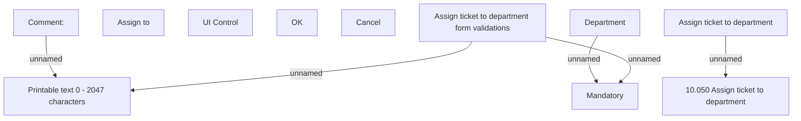

# Assign ticket to department - user interface

- **Diagram Type**: Custom
- **Package**: HomerSelect/BSL/Modules/Ticketing (TCK)/Analytical Model/User Interface Model/Assign ticket to department
- **Diagram ID**: 156201
- **Elements**: 12
- **Connectors**: 5

