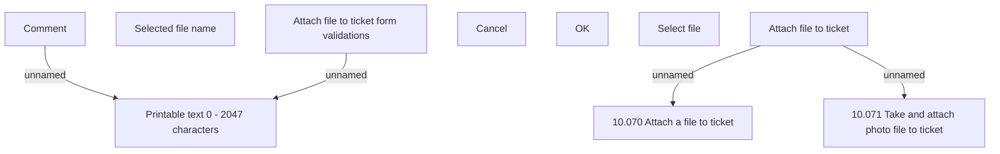

# Attach file to ticket - user interface

```mermaid
graph TD
    Attach_file_to_ticket_form_validations["Attach file to ticket form validations"]
    n_10_071_Take_and_attach_photo_file_to_ticket["10.071 Take and attach photo file to ticket"]
    Selected_file_name["Selected file name"]
    Printable_text_0_2047_characters["Printable text 0 - 2047 characters"]
    n_10_070_Attach_a_file_to_ticket["10.070 Attach a file to ticket"]
    Comment["Comment"]
    Cancel["Cancel"]
    OK["OK"]
    Select_file["Select file"]
    Attach_file_to_ticket["Attach file to ticket"]
    Attach_file_to_ticket -->|unnamed| n_10_070_Attach_a_file_to_ticket
    Comment -->|unnamed| Printable_text_0_2047_characters
    Attach_file_to_ticket -->|unnamed| n_10_071_Take_and_attach_photo_file_to_ticket
    Attach_file_to_ticket_form_validations -->|unnamed| Printable_text_0_2047_characters
```
