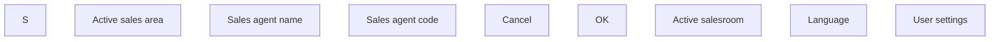

# Change language - user interface

- **Diagram Type**: Custom
- **Package**: HomerSelect/BSL/Modules/Ticketing (TCK)/Analytical Model/User Interface Model/Change language
- **Diagram ID**: 156203
- **Elements**: 10
- **Connectors**: 0

